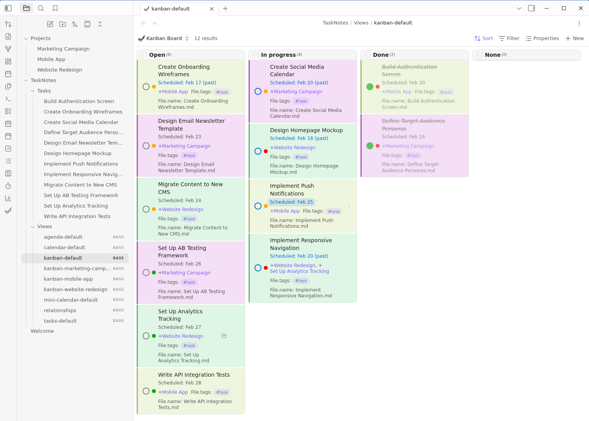

# TaskNotes Project Colors

Automatically colors [TaskNotes](https://github.com/callumalpass/obsidian-task-notes) task cards by project. Each project gets a distinct background color and left border, computed from a hash of the project name. Adding a new project requires zero configuration — the color is assigned automatically.



## How it works

The plugin watches the DOM for TaskNotes task cards. When a card contains a project link, it:

1. Reads the project name from the link's `data-href` attribute
2. Computes a [DJB2 hash](https://en.wikipedia.org/wiki/Daniel_J._Bernstein#Hash_function) of the name
3. Maps the hash to a hue value (0–359)
4. Sets a `--project-hue` CSS custom property on the card

The plugin's stylesheet then applies a tinted background and colored left border using that hue. Both light and dark themes are supported.

Colors appear in all TaskNotes views that render task cards (kanban, task list, agenda).

## Customization

To tweak the saturation or lightness of the colors, create a CSS snippet in your vault (Settings → Appearance → CSS snippets) that overrides the defaults:

```css
/* Example: more saturated, slightly darker backgrounds */
.tasknotes-plugin .task-card[style*="--project-hue"] {
    background-color: hsl(var(--project-hue), 70%, 88%);
    border-left: 3px solid hsl(var(--project-hue), 60%, 50%);
}
.theme-dark .tasknotes-plugin .task-card[style*="--project-hue"] {
    background-color: hsl(var(--project-hue), 40%, 15%);
    border-left: 3px solid hsl(var(--project-hue), 50%, 35%);
}
```

## Installation

### From Obsidian Community Plugins

1. Open Settings → Community Plugins → Browse
2. Search for "TaskNotes Project Colors"
3. Click Install, then Enable

### Manual

1. Download `main.js`, `manifest.json`, and `styles.css` from the [latest release](https://github.com/minorchange/obsidian-tasknotes-project-colors/releases/latest)
2. Create a folder `your-vault/.obsidian/plugins/tasknotes-project-colors/`
3. Place the three files in that folder
4. Restart Obsidian and enable the plugin in Settings → Community Plugins
